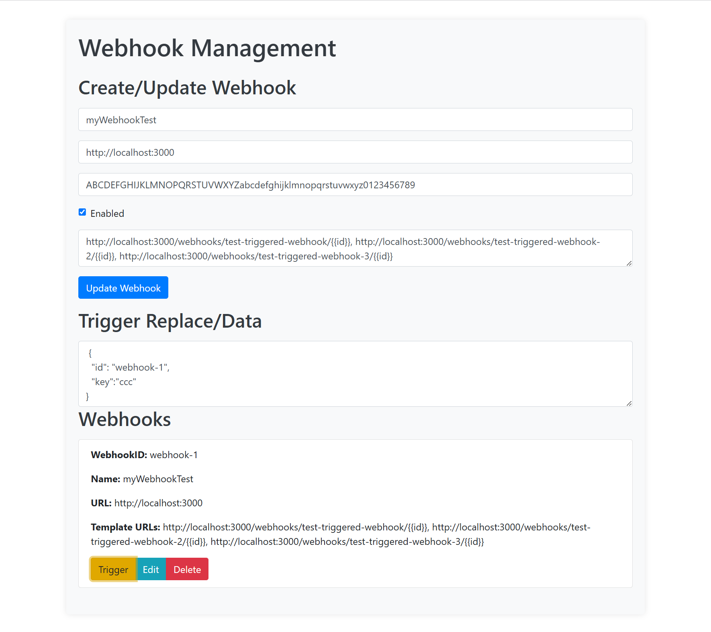
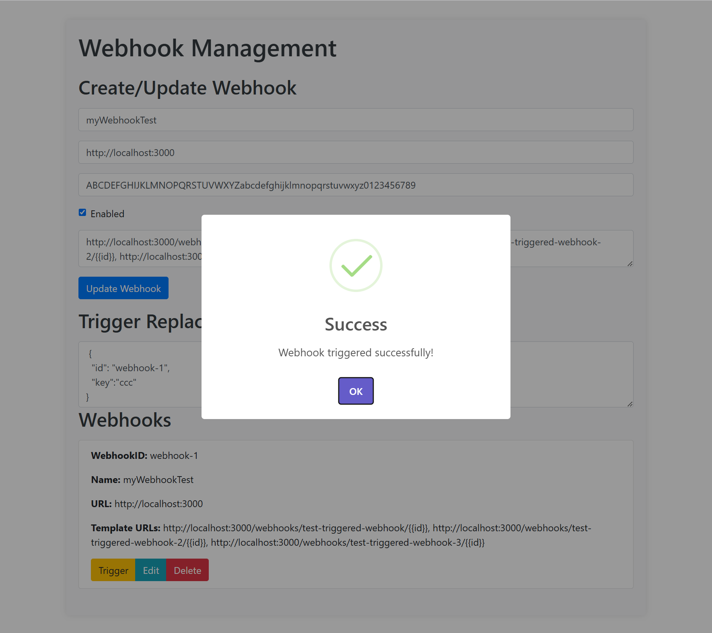
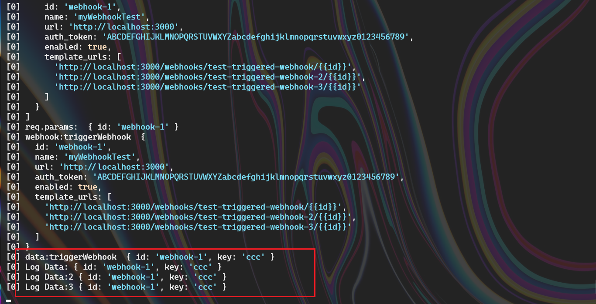

# Webhook Service Test

## Introduction

**A web service for managing webhooks, supporting the creation, reading, updating, and deletion of webhooks, capable of triggering HTTP requests.**

## Features

* **Uses JSON as the request and response format**
* **Supports template token replacement**
* **Authentication mechanism (using auth_token)**
* **Prepared to handle high traffic**

## Installation

```
npm install
```

## Start the Service

```
npm run start
```

**The webhook-server runs in the background at** `http://localhost:3000`.

**The svelte-webhook-ui runs at** `http://localhost:8080`.

## API Documentation

### Create Webhook

**POST** `/webhooks`

###### Request Body:

```
{
  "name": "Webhook Name",
  "url": "http://localhost:3000",
  "auth_token": "your_auth_token",
  "enabled": true,
  "template_urls": [
    "http://localhost:3000/webhooks/test-triggered-webhook/{{id}}",
    "http://localhost:3000/webhooks/test-triggered-webhook-2/{{id}}",
    "http://localhost:3000/webhooks/test-triggered-webhook-3/{{id}}"
  ]
}
```

### Get All Webhooks

**GET** `/webhooks`

### Get Single Webhook

**GET** `/webhooks/:id`

### Update Webhook

**PUT** `/webhooks/:id`

**Request Body is the same as Create.**

### Delete Webhook

**DELETE** `/webhooks/:id`

### Trigger Webhook

**POST** `/webhooks/:id/trigger`

### Test Triggered Webhook Success

**POST** `/test-triggered-webhook/:id`

**POST** `/test-triggered-webhook-2/:id`

**POST** `/test-triggered-webhook-3/:id`

###### **Request Body:**

```
{
  "id": "webhook-1",
  "key": "xxx" 
}
```

## Test Usage






